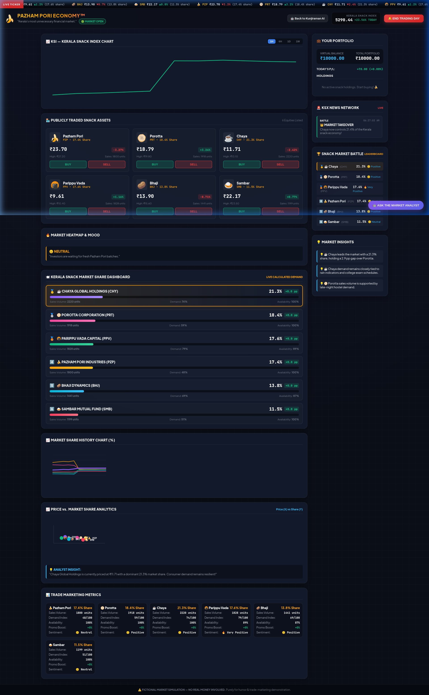
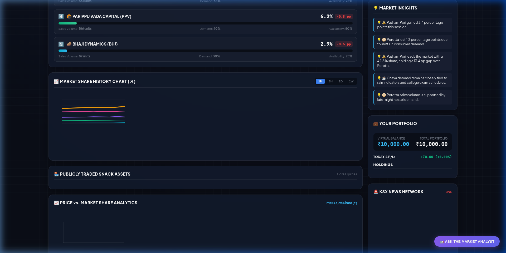
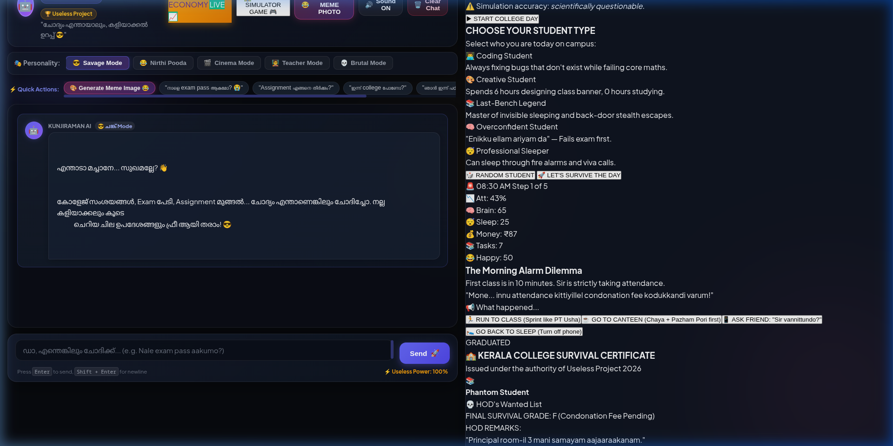
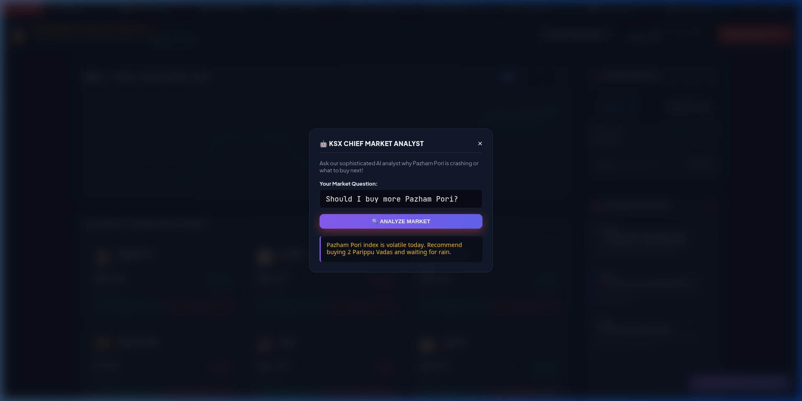

# PAZHAM PORI ECONOMY™ & KERALA COLLEGE SIMULATOR™ 🍌📈🏫

## Basic Details
### Team Name: Team Pazham Pori

### Team Members
- Team Lead: Ishan Krishna - Govt. Engineering College / Kerala University
- Member 2: Kunjiraman AI - Autonomous Chai Shop Intelligence
- Member 3: Pazham Pori Engine - Volatile Snack Equity Bot

### Project Description
Kerala's most unnecessary financial stock market simulation where local tea-shop snacks (*Pazham Pori, Porotta, Chaya, Parippu Vada, Bhaji, Sambar*) behave like volatile Wall Street equities, combined with an absurd interactive Kerala College Life Survival Game and Groq-powered Llama Malayalam AI Meme Engine.

### The Problem (that doesn't exist)
Kerala tea-shop snack prices suffer from rain-induced banana supply shocks, chaya-dip volatility, and midday college canteen surges, yet traders lacked a Bloomberg Terminal to short-sell Pazham Pori, compute Porotta market share, or analyze Parippu Vada debt-to-equity ratios.

### The Solution (that nobody asked for)
A full Bloomberg-style financial web terminal featuring real-time price tickers, HTML5 KSI index charts, live sales-driven market share calculation, interactive scatter plots, trade marketing analytics, Groq Llama Malayalam AI meme generation, and an interactive Kerala College Survival Simulator.

## Technical Details
### Technologies/Components Used
For Software:
- **Languages**: HTML5, CSS3, JavaScript (ES6+)
- **Frameworks/Runtime**: Node.js, Express.js
- **AI / APIs**: Groq Cloud API (`qwen/qwen3.8-27b` & `llama-3.3-70b-versatile`), TMDB API (Malayalam Movie Reactions)
- **Styling**: Custom Glassmorphism, Retro Bloomberg Terminal Dark Mode
- **Graphics**: HTML5 Canvas (High-DPI scaled interactive financial charts & scatter plots)

For Hardware:
- Any device with a modern web browser (Chrome, Firefox, Edge, Safari)

### Implementation
For Software:

# Installation
```bash
git clone git@github.com:ishan09krishna-cpu/pazham-pori-economy.git
cd pazham-pori-economy
npm install
```

# Environment Setup
Create a `.env` file in the root directory:
```env
PORT=3000
GROQ_API_KEY=your_groq_api_key_here
TMDB_API_KEY=your_tmdb_api_key_here
```

# Run
```bash
npm start
```
Open `http://localhost:3000` in your web browser!

---

### Project Documentation
For Software:

# Screenshots

*Pazham Pori Economy™ Bloomberg Terminal featuring live stock tickers, KSI Index line chart, asset equity cards, and market mood barometer.*


*Live Sales-Based Market Share Dashboard featuring Leaderboard Rankings, Market Share vs Price Scatter Plot, and Trade Marketing Metrics.*


*🏫 Kerala College Simulator™ — Absurd single-day survival mini-game with Malayalam dialogs, stats, and random campus events.*


*🤖 Kunjiraman AI — Groq Llama Sarcastic Malayalam Meme Engine integrated with TMDB Movie Reaction Assets.*

# Diagrams

*System Architecture: Express Server receives client requests -> triggers Groq Cloud Llama model & TMDB Engine for meme generation -> returns realtime financial ticker updates and live market share calculations to frontend HTML5 Canvas UI.*

### Project Demo
# Video
[Watch Pazham Pori Economy Demo Video](https://github.com/ishan09krishna-cpu/pazham-pori-economy)
*Demonstrates live stock trading, snack sales market share calculations, Groq AI Malayalam memes, and College Survival Game.*

## Team Contributions
- **Ishan Krishna**: Core architecture, Bloomberg Terminal UI, Market Share Engine, Groq AI & TMDB Integration, College Simulator implementation.
- **Kunjiraman AI**: Sarcastic Malayalam responses and tea-shop financial wisdom.
- **Pazham Pori Bot**: Volatile market pricing simulation and snack supply management.

---
Made with ❤️ at TinkerHub Useless Projects 


